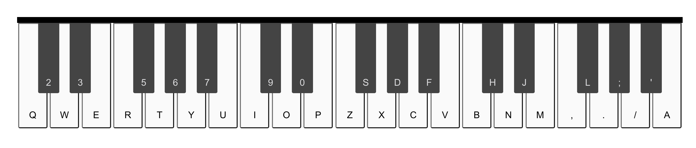

## Table of contents
* [General info](#general-info)
* [Technologies](#technologies)
* [Setup](#setup)

## General info
This is an interactive keyboard piano app. The online piano keyboard simulates a real piano keyboard

<div align="left">
     
</div>

[Live Demo](https://msynko.github.io/react-piano/)

## Technologies
Project is created with:
* React version: 16.12.0
* Soundfont loader/player version: 0.12.0


## Setup
To run this project, install it locally using npm:

```
$ cd ../react-piano
$ npm install
$ npm start

```
